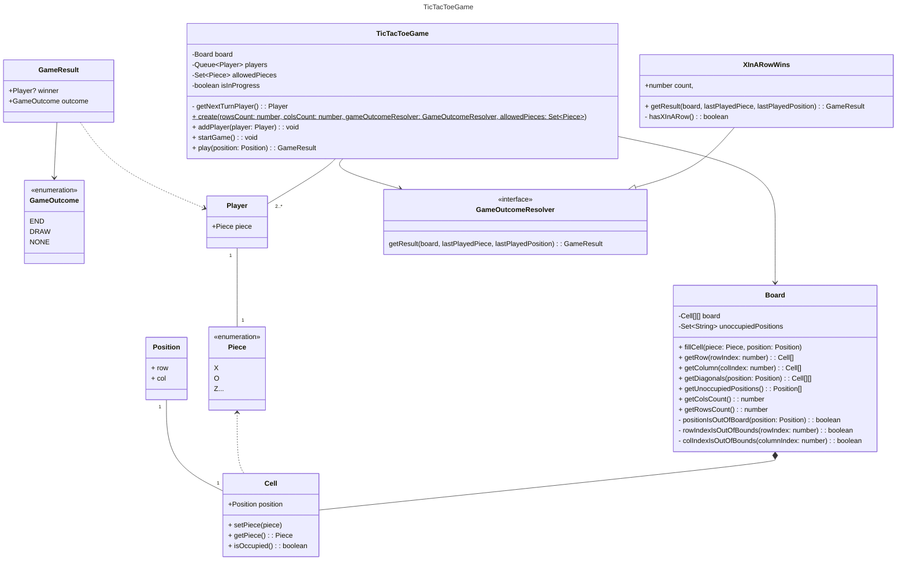

# TDD-ed TicTacToe

This is a special TicTacToe game implementation, built following the TDD approach, that adheres to the OOP best practices and SOLID principles.

# Class diagram

_You can also check the [exported PNG](docs/class-diagram.png)._

# How to use?

It is very easy to build any kind of frontend (CLI/GUI/TUI) on top of this implementation. [The game flow tests file](/tests/gameFlow.spec.ts) simulates a few games with different outcomes.

# Why?

The main selling points of this approach are:

- Being able to implement new rules for defining the winner / game outcome without changing any of the already existing code. You only need to implement the `GameOutcomeResolver` class (**Open Closed Principle**).
- Each class has very strict logic boundaries and doesn't know that it is used as part of a TicTacToe game. For example, the `Board` class is very generic and can even be reused for other board based games (**Single Responsibility Principle**).
- The game settings can be easily changed. For example, it is possible to create a TicTacToe game with a 10x10 board and as many players as needed.
- Easily testable by design, since it was built following the TDD approach.

# Assumptions

- The game can't be played with less than 2 players, but has no limit on the maximum number of players.
- The minimum TicTacToe board size is 3x3.
